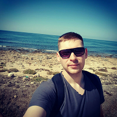

# Обо мне 

Меня зовут Ишуков Сергей. Я студент Нетологии, учусь на курсе "QA инженер от нуля до middle"

Работаю ведущим инженером-электроником промышленной автоматизации в сталеплавильном комплексе FeO32 группы ТМК.

